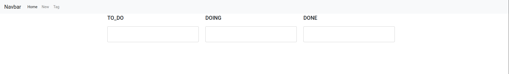

# Mise en place d'une application to-do avec une stack similaire à MAIA

## Installer les dépendances
**Flyway**
```bash
wget -qO- https://repo1.maven.org/maven2/org/flywaydb/flyway-commandline/8.5.10/flyway-commandline-8.5.10-linux-x64.tar.gz | tar xvz && sudo ln -s `pwd`/flyway-8.5.10/flyway /usr/local/bin 
```
**Docker et docker-compose**
[Installer Docker](https://docs.docker.com/engine/install/ubuntu/)
[Installer Docker compose](https://docs.docker.com/compose/install/)


## Lancer l'application
### Docker
```bash
docker-compose build && docker-compose up -d
```
Si des modifications sont faites sur todo-front et todo-postgraphile, lancer `build.sh`

### Base de donnée
Si le container de la DB est bien lancé :
```bash
cd ./todo-conception && flyway migrate && cd -
```

### Keycloak
Une fois Keycloak lancé, se connecter sur http://localhost:8081
(Keycloak prend parfois plusieurs minutes à démarrer)

Se connecter à `Administration console` avec les identifiants keycloak présents dans `./config/keycloak.env`

Créer un nouveau realm et importer le fichier `realm-export.json` : [Doc](https://wjw465150.gitbooks.io/keycloak-documentation/content/server_admin/topics/realms/create.html)

Une fois le realm créée, se rendre dans `Clients > kong` et ouvrir l'onglet `credentials` et réinitialiser les credentials avec `Regenerate Secret`.


Puis remplacer dans le ficher `./kong.yml` les entrée `client_secret` avec le token de Keycloak.

Il faut également créer un utilisateur dans Keycloak : [Doc](https://www.appsdeveloperblog.com/keycloak-creating-a-new-user/)
(S'assurer de bien lui set `Email verified` à `true` et également lui donner un mot de passe dans l'onglet credentials et set `temporary` à `false`)

### Kong
A la différence de la stack maia où Kong est lié avec une DB (pour l'instant), dans cet exemple c'est un fichier déclaratif qui définit les routes.
```bash
curl -X POST http://localhost:8001/config -F config=@kong.yml
```

### Fin
Presque un équivalent de Trello doit être accessible sur http://localhost 

